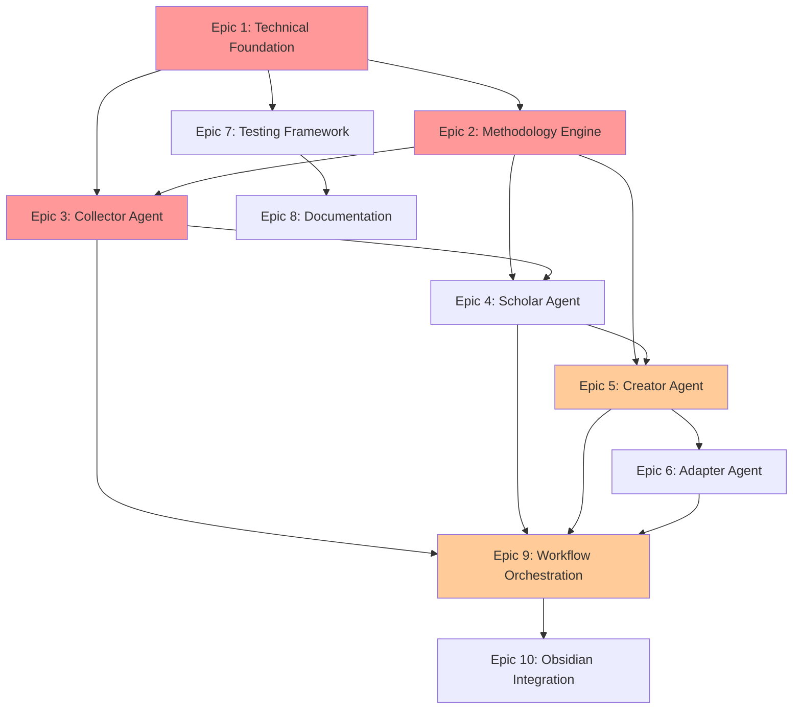

# **FLCM Product Roadmap & MVP Prioritization**

*Version 1.0 | December 2024*

---

## **Executive Summary**

This roadmap outlines the phased development approach for FLCM, prioritizing features that deliver maximum value while building on BMAD's proven architecture. The MVP focuses on establishing the core content creation pipeline with a single agent workflow, then progressively adds sophistication through methodologies and multi-platform adaptation.

**MVP Target:** Functional content creation system in 6-8 weeks
**Full Release:** Complete four-agent system with Obsidian integration in 12-16 weeks

---

## **Epic Dependency Map**



**Legend:**
- 🔴 Red: Critical path for MVP
- 🟡 Orange: MVP enhancement
- ⚪ White: Post-MVP features

---

## **Phase 1: MVP Foundation (Weeks 1-3)**

### **Goal: Establish Core Infrastructure**

| Epic | Priority | Scope for MVP | Rationale |
|------|----------|---------------|-----------|
| **Epic 1: Technical Foundation** | P0 - Critical | • Repository structure<br>• Core config system<br>• Basic command integration<br>• Document pipeline | Foundation for everything - cannot proceed without this |
| **Epic 2: Methodology Engine** | P0 - Critical | • Basic methodology framework<br>• 2-3 core methodologies (RICE, SPARK)<br>• Simple transparency | Differentiator - methodologies are core value prop |
| **Epic 7: Testing Framework** | P1 - Important | • Basic validation framework<br>• Manual test checklists<br>• Success criteria | Ensures quality from day one |

### **Deliverables:**
- ✅ Working .flcm-core/ structure
- ✅ Basic methodology execution
- ✅ Command system operational
- ✅ Document templates ready

---

## **Phase 2: MVP Core Agents (Weeks 4-6)**

### **Goal: Implement Minimal Content Pipeline**

| Epic | Priority | Scope for MVP | Rationale |
|------|----------|---------------|-----------|
| **Epic 3: Collector Agent** | P0 - Critical | • URL processing<br>• Basic signal extraction<br>• Content Brief generation | Entry point for all content |
| **Epic 5: Creator Agent** | P0 - Critical | • Basic draft creation<br>• Simple voice preservation<br>• One refinement round | Core value delivery |
| **Epic 9: Workflow Orchestration** | P0 - Critical | • Basic agent communication<br>• Simple pipeline<br>• Quick Mode only | Connects agents into usable system |

### **Deliverables:**
- ✅ Collector → Creator pipeline working
- ✅ Quick Mode (20-30 min) operational
- ✅ Basic content generation proven
- ✅ Voice preservation demonstrated

### **MVP Feature Set:**
```yaml
Included:
  - Single source collection (URL or text)
  - Basic signal extraction (RICE)
  - Simple content creation
  - One-round refinement
  - Single output format (markdown)
  - Quick Mode workflow
  - Basic error handling

Excluded (Post-MVP):
  - Scholar Agent (learning depth)
  - Adapter Agent (multi-platform)
  - Obsidian integration
  - Standard Mode (45-60 min)
  - Advanced methodologies
  - Teaching preparation
  - Platform optimization
```

---

## **Phase 3: Enhanced Intelligence (Weeks 7-9)**

### **Goal: Add Learning and Adaptation**

| Epic | Priority | Scope | Rationale |
|------|----------|--------|-----------|
| **Epic 4: Scholar Agent** | P1 - Important | • Progressive depth<br>• Basic analogies<br>• Concept synthesis | Deepens understanding |
| **Epic 6: Adapter Agent** | P1 - Important | • 2 platforms (LinkedIn, Twitter)<br>• Basic optimization<br>• Hashtag generation | Enables multi-platform reach |
| **Epic 2: Methodologies** | P1 - Important | • Extended library<br>• All core methodologies<br>• Chaining support | Full methodology power |

### **Deliverables:**
- ✅ Four-agent pipeline complete
- ✅ Learning enhancement working
- ✅ Multi-platform adaptation
- ✅ Standard Mode operational

---

## **Phase 4: Knowledge Persistence (Weeks 10-12)**

### **Goal: Long-term Value Creation**

| Epic | Priority | Scope | Rationale |
|------|----------|--------|-----------|
| **Epic 10: Obsidian Integration** | P2 - Nice to Have | • Vault structure<br>• Auto-filing<br>• Wiki-links<br>• Knowledge graph | Long-term knowledge value |
| **Epic 8: Documentation** | P1 - Important | • User guide<br>• Examples<br>• Troubleshooting | User success enablement |

### **Deliverables:**
- ✅ Obsidian vault integration
- ✅ Knowledge persistence
- ✅ Complete documentation
- ✅ Example library

---

## **Phase 5: Polish & Scale (Weeks 13-16)**

### **Goal: Production Readiness**

| Epic | Priority | Scope | Rationale |
|------|----------|--------|-----------|
| **Epic 6: Adapter Agent** | P2 - Complete | • All 4 platforms<br>• Advanced optimization<br>• A/B variants | Full platform coverage |
| **Epic 4: Scholar Agent** | P2 - Complete | • Teaching mode<br>• Reflection docs<br>• Confidence tracking | Complete learning features |
| **Epic 7: Testing** | P2 - Complete | • Automated tests<br>• E2E validation<br>• Performance benchmarks | Production quality |

---

## **MVP Success Criteria**

### **Functional Requirements:**
- [ ] Process a URL and generate content in < 30 minutes
- [ ] Maintain consistent voice across 3+ content pieces
- [ ] Extract 5+ meaningful insights from sources
- [ ] Generate publication-ready content requiring < 20% editing

### **Non-Functional Requirements:**
- [ ] Agent response time < 3 seconds
- [ ] Command execution without errors 80% of time
- [ ] Clear methodology transparency
- [ ] Graceful error recovery

### **User Validation Metrics:**
- [ ] 5 beta users successfully create content
- [ ] Average time reduction: 50% (from 3 hours to 1.5 hours)
- [ ] Voice consistency rating: 7+/10
- [ ] User satisfaction: Would recommend to others

---

## **Risk Mitigation Strategy**

| Risk | Impact | Mitigation |
|------|--------|------------|
| **Methodology complexity** | High | Start with 2-3 proven methodologies, add incrementally |
| **Voice preservation accuracy** | High | Focus on simple pattern matching first, enhance with user feedback |
| **Claude Code limitations** | Medium | Design for constraints, prepare fallback strategies |
| **User adoption friction** | Medium | Provide clear examples and Quick Mode for easy start |
| **Obsidian integration issues** | Low | Defer to post-MVP, ensure standalone value |

---

## **Development Velocity Assumptions**

Based on BMAD patterns and complexity analysis:

| Phase | Story Points | Duration | Confidence |
|-------|--------------|----------|------------|
| Phase 1 (Foundation) | 40 | 3 weeks | High (90%) |
| Phase 2 (Core Agents) | 35 | 3 weeks | High (85%) |
| Phase 3 (Enhancement) | 45 | 3 weeks | Medium (70%) |
| Phase 4 (Persistence) | 30 | 3 weeks | Medium (65%) |
| Phase 5 (Polish) | 40 | 4 weeks | Low (50%) |

**Total: 190 story points over 16 weeks**

---

## **Go-to-Market Readiness**

### **MVP Launch (Week 6):**
- **Target Users:** 5-10 beta testers from Friction Lab community
- **Value Prop:** "Create content 50% faster with AI-guided methodologies"
- **Success Metric:** 3+ users create 5+ pieces of content

### **Beta Launch (Week 9):**
- **Target Users:** 25-50 content creators
- **Value Prop:** "Learn while you create - methodology-driven content generation"
- **Success Metric:** 70% continue using after 2 weeks

### **Full Launch (Week 16):**
- **Target Users:** Open availability
- **Value Prop:** "Transform content creation into skill-building with persistent knowledge"
- **Success Metric:** 100+ active users, 1000+ content pieces created

---

## **Resource Requirements**

### **Development:**
- 1 Full-stack developer (familiar with BMAD)
- Claude Code environment
- GitHub repository

### **Testing:**
- 5-10 beta users for MVP validation
- 25-50 users for beta program
- Feedback collection system

### **Support:**
- Documentation (Epic 8)
- Example content library
- Discord/Slack community (optional)

---

## **Decision Points**

### **Week 3 - Post Foundation:**
- ✅ Go/No-Go on agent development
- ✅ Confirm methodology selection
- ✅ Validate technical approach

### **Week 6 - MVP Complete:**
- ✅ Launch beta or iterate?
- ✅ Which features to prioritize next?
- ✅ Platform expansion strategy?

### **Week 9 - Enhanced System:**
- ✅ Obsidian integration priority?
- ✅ Additional platform support?
- ✅ Advanced methodology development?

### **Week 12 - Near Completion:**
- ✅ Launch strategy confirmation
- ✅ Scaling preparation
- ✅ Monetization approach (if any)

---

## **Next Steps**

### **Immediate Actions (This Week):**
1. Set up repository with .flcm-core/ structure
2. Create Epic 1 stories in docs/stories/
3. Begin technical foundation implementation
4. Recruit 5 beta testers for MVP validation

### **Week 1 Deliverables:**
- [ ] Complete repository structure
- [ ] Basic command system working
- [ ] First methodology implemented
- [ ] Document pipeline tested

### **Success Indicators:**
- First content piece generated by end of Week 4
- Beta user creating content by Week 6
- Positive feedback on methodology transparency
- Measurable time savings demonstrated

---

## **Conclusion**

This roadmap prioritizes delivering a functional MVP in 6 weeks that proves the core value proposition: **methodology-driven content creation that reduces time by 50%**. By leveraging BMAD's architecture and focusing on the essential Collector→Creator pipeline first, we can validate the concept quickly and iterate based on user feedback.

The phased approach allows for:
1. **Early validation** of core assumptions
2. **Incremental complexity** as we learn
3. **Risk mitigation** through staged development
4. **User feedback integration** at each phase

The key to success is maintaining focus on the MVP scope while building a foundation that supports the full vision.

---

*End of Roadmap Document*