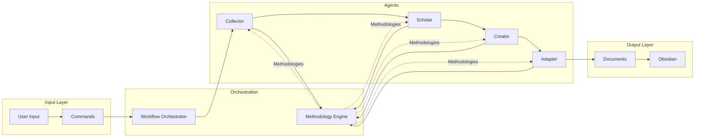

# **Components**

## **Collector Agent Component**
**Responsibility:** Process diverse sources and extract meaningful signals using methodologies like RICE, signal-to-noise analysis, and pattern recognition

**Key Interfaces:**
- `collect(sources: Source[]): ContentBrief`
- `extractSignals(content: string): Insight[]`
- `scoreRelevance(insight: Insight): number`

**Dependencies:** Methodology Engine, Web Fetch, Document Parser

**Technology Stack:** YAML agent definition, Markdown tasks, Signal extraction methodologies

## **Scholar Agent Component**
**Responsibility:** Transform information into deep understanding through progressive learning, analogies, and teaching preparation

**Key Interfaces:**
- `synthesize(brief: ContentBrief): KnowledgeSynthesis`
- `generateAnalogies(concept: string): Analogy[]`
- `assessUnderstanding(): ConfidenceScore`
- `prepareTeaching(concept: string): TeachingPlan`

**Dependencies:** Methodology Engine, Knowledge Graph, Learning Frameworks

**Technology Stack:** YAML agent definition, Learning methodologies (Feynman, Socratic, Progressive Depth)

## **Creator Agent Component**
**Responsibility:** Maintain authentic voice while producing high-quality content through iterative refinement

**Key Interfaces:**
- `createDraft(synthesis: KnowledgeSynthesis): ContentDraft`
- `analyzeVoice(samples: string[]): VoiceProfile`
- `refineContent(draft: ContentDraft, feedback: string): ContentDraft`

**Dependencies:** Methodology Engine, Voice Analyzer, Structure Frameworks

**Technology Stack:** YAML agent definition, Creation methodologies (SPARK, PREP, Voice DNA)

## **Adapter Agent Component**
**Responsibility:** Optimize content for each platform while maintaining message integrity

**Key Interfaces:**
- `adaptForPlatform(draft: ContentDraft, platform: Platform): PlatformAdaptation`
- `optimizeEngagement(content: string, rules: PlatformRules): string`
- `generateHashtags(content: string, platform: Platform): string[]`

**Dependencies:** Methodology Engine, Platform Rules, Engagement Models

**Technology Stack:** YAML agent definition, Platform optimization models

## **Methodology Engine Component**
**Responsibility:** Execute pluggable thinking tools and methodologies transparently

**Key Interfaces:**
- `executeMethodology(name: string, input: any): MethodologyResult`
- `chainMethodologies(methods: string[], input: any): ChainResult`
- `explainMethodology(name: string): MethodologyExplanation`

**Dependencies:** Methodology Library, Validation Framework

**Technology Stack:** YAML methodology definitions, Pluggable framework system

## **Workflow Orchestrator Component**
**Responsibility:** Coordinate agent collaboration and manage document pipeline

**Key Interfaces:**
- `executeWorkflow(type: WorkflowType, input: any): PublishPackage`
- `routeDocument(doc: Document, nextAgent: AgentId): void`
- `validateTransition(from: Stage, to: Stage): boolean`

**Dependencies:** All Agents, Document Pipeline, State Manager

**Technology Stack:** YAML workflow definitions, Event-driven orchestration

## **Component Interaction Diagram**

---
