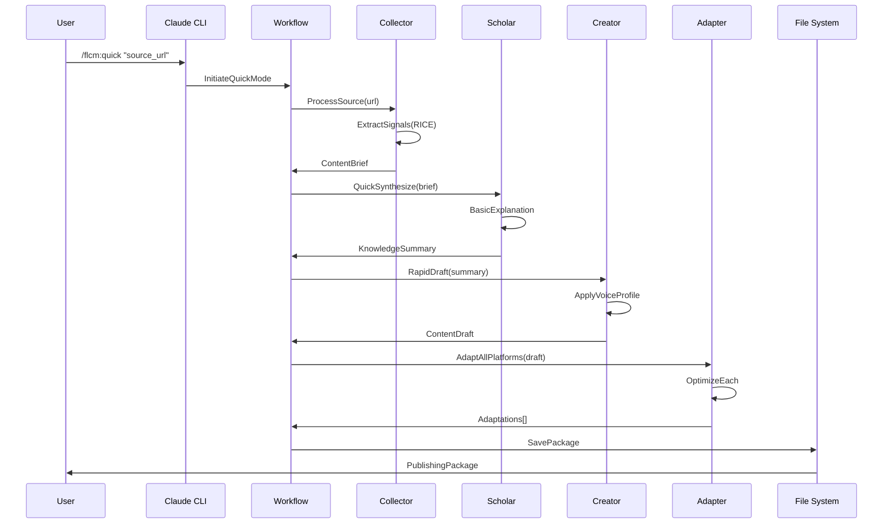
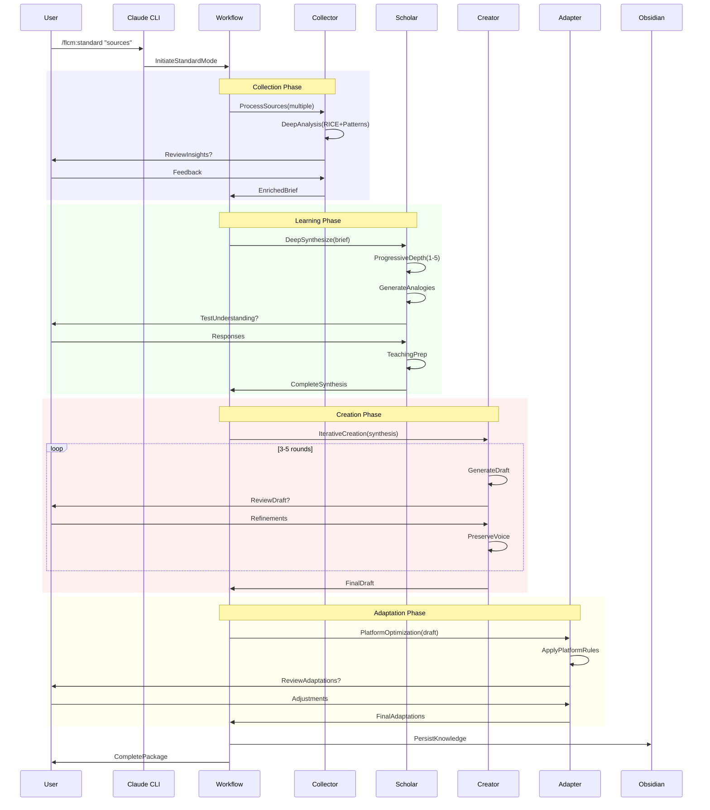

# **Core Workflows**

## **Quick Mode Workflow (20-30 min)**

```mermaid
sequenceDiagram
    participant User
    participant CLI as Claude CLI
    participant WF as Workflow
    participant COL as Collector
    participant SCH as Scholar
    participant CRE as Creator
    participant ADA as Adapter
    participant FS as File System
    
    User->>CLI: /flcm:quick "source_url"
    CLI->>WF: InitiateQuickMode
    WF->>COL: ProcessSource(url)
    COL->>COL: ExtractSignals(RICE)
    COL->>WF: ContentBrief
    WF->>SCH: QuickSynthesize(brief)
    SCH->>SCH: BasicExplanation
    SCH->>WF: KnowledgeSummary
    WF->>CRE: RapidDraft(summary)
    CRE->>CRE: ApplyVoiceProfile
    CRE->>WF: ContentDraft
    WF->>ADA: AdaptAllPlatforms(draft)
    ADA->>ADA: OptimizeEach
    ADA->>WF: Adaptations[]
    WF->>FS: SavePackage
    FS->>User: PublishingPackage
```

## **Standard Mode Workflow (45-60 min)**

```mermaid
sequenceDiagram
    participant User
    participant CLI as Claude CLI
    participant WF as Workflow
    participant COL as Collector
    participant SCH as Scholar
    participant CRE as Creator
    participant ADA as Adapter
    participant OBS as Obsidian
    
    User->>CLI: /flcm:standard "sources"
    CLI->>WF: InitiateStandardMode
    
    rect rgb(240, 240, 255)
        Note over WF,COL: Collection Phase
        WF->>COL: ProcessSources(multiple)
        COL->>COL: DeepAnalysis(RICE+Patterns)
        COL->>User: ReviewInsights?
        User->>COL: Feedback
        COL->>WF: EnrichedBrief
    end
    
    rect rgb(240, 255, 240)
        Note over WF,SCH: Learning Phase
        WF->>SCH: DeepSynthesize(brief)
        SCH->>SCH: ProgressiveDepth(1-5)
        SCH->>SCH: GenerateAnalogies
        SCH->>User: TestUnderstanding?
        User->>SCH: Responses
        SCH->>SCH: TeachingPrep
        SCH->>WF: CompleteSynthesis
    end
    
    rect rgb(255, 240, 240)
        Note over WF,CRE: Creation Phase
        WF->>CRE: IterativeCreation(synthesis)
        loop 3-5 rounds
            CRE->>CRE: GenerateDraft
            CRE->>User: ReviewDraft?
            User->>CRE: Refinements
            CRE->>CRE: PreserveVoice
        end
        CRE->>WF: FinalDraft
    end
    
    rect rgb(255, 255, 240)
        Note over WF,ADA: Adaptation Phase
        WF->>ADA: PlatformOptimization(draft)
        ADA->>ADA: ApplyPlatformRules
        ADA->>User: ReviewAdaptations?
        User->>ADA: Adjustments
        ADA->>WF: FinalAdaptations
    end
    
    WF->>OBS: PersistKnowledge
    WF->>User: CompletePackage
```

---
