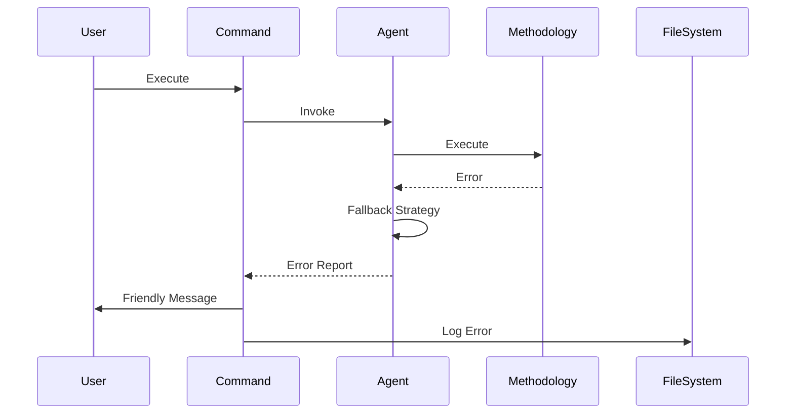

# **Error Handling Strategy**

## **Error Flow**



## **Error Response Format**

```typescript
interface FLCMError {
  error: {
    code: string;          // FLCM_COLLECT_FAILED
    message: string;       // User-friendly message
    details?: {
      agent: string;
      methodology?: string;
      phase: string;
      suggestion: string;  // How to fix
    };
    timestamp: string;
    sessionId: string;
  };
}
```

## **Frontend Error Handling**
```typescript
// Command error handler
async function handleCommandError(error: FLCMError): Promise<void> {
  console.error(`❌ ${error.error.message}`);
  
  if (error.error.details?.suggestion) {
    console.log(`💡 Suggestion: ${error.error.details.suggestion}`);
  }
  
  // Log to debug file
  await logError(error);
  
  // Offer recovery options
  console.log('\nRecovery options:');
  console.log('1. Retry with different input');
  console.log('2. Skip this step');
  console.log('3. View debug log');
}
```

## **Backend Error Handling**
```typescript
// Agent error handler
class AgentErrorHandler {
  async handle(error: Error, context: AgentContext): Promise<void> {
    // Classify error
    const errorType = this.classifyError(error);
    
    // Apply recovery strategy
    switch (errorType) {
      case 'NETWORK':
        return await this.retryWithBackoff(context);
      case 'PARSING':
        return await this.fallbackParser(context);
      case 'METHODOLOGY':
        return await this.useAlternativeMethodology(context);
      default:
        throw new FLCMError(error, context);
    }
  }
}
```

---
