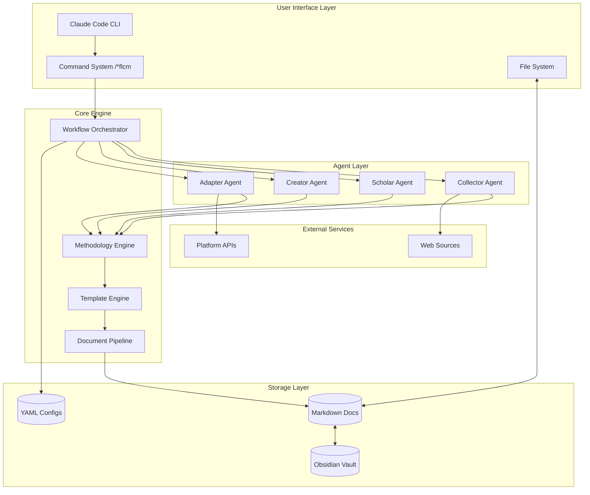

# **High Level Architecture**

## **Technical Summary**

FLCM implements a **methodology-embedded agent architecture** within Claude Code, where four specialized agents (Collector, Scholar, Creator, Adapter) collaborate through a YAML-driven workflow system borrowed from BMAD. The system operates as a local-first application with file system integration for Obsidian knowledge management, processing content through a document pipeline that transforms sources into multi-platform publications. Each agent provides structured thinking frameworks that guide users through content creation while building a persistent knowledge network. The architecture achieves PRD goals by reducing creation time through methodological automation while preserving authentic voice and enabling cross-platform scaling.

## **Platform and Infrastructure Choice**

**Platform:** Local Development Environment (Claude Code)
**Key Services:** 
- Claude Code as execution environment
- Local file system for document storage
- Obsidian integration for knowledge persistence
- Git for version control (optional)
- Web APIs for content collection

**Deployment Host and Regions:** Local machine execution with cloud API access

## **Repository Structure**

**Structure:** Monorepo following BMAD pattern
**Monorepo Tool:** N/A (single project structure)
**Package Organization:** 
```
.flcm-core/        # Core FLCM system (mirrors .bmad-core/)
.claude/           # Claude Code integration
docs/              # Generated content and documentation
```

## **High Level Architecture Diagram**



## **Architectural Patterns**

- **BMAD Agent Architecture:** YAML-defined agents with commands, tasks, and dependencies - *Rationale:* Proven pattern for AI agent orchestration that enables flexible, maintainable agent definitions
- **Methodology-Driven Processing:** Embedded thinking tools guide each step - *Rationale:* Transforms AI from black box to transparent process, building user capabilities
- **Document Pipeline Pattern:** Clear input→process→output for each stage - *Rationale:* Provides certainty through concrete artifacts at each step
- **Template-Based Generation:** YAML templates define document structures - *Rationale:* Ensures consistency while allowing customization
- **Task-Based Workflows:** Executable markdown tasks with validation - *Rationale:* Makes complex processes repeatable and testable
- **Local-First Architecture:** All processing happens locally with optional cloud - *Rationale:* Privacy, speed, and ownership of content
- **Event-Driven Agent Communication:** Agents communicate through document events - *Rationale:* Loose coupling enables independent agent evolution
- **Knowledge Graph Pattern:** Bi-directional linking builds connections - *Rationale:* Compound knowledge value over time

---
