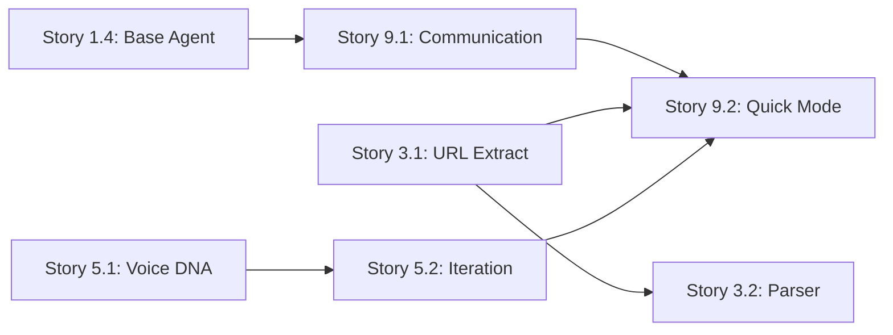

# Story Validation Report - Phase 2 (MVP Core)

*Generated: 2024-12-28*

---

## **Story 3.1: URL Content Extraction**

### Quick Summary
- **Story readiness:** ✅ READY
- **Clarity score:** 9/10
- **Major gaps:** None

### Validation Results

| Category | Status | Issues |
|----------|--------|--------|
| 1. Goal & Context Clarity | PASS | Clear purpose for URL processing and content extraction |
| 2. Technical Implementation Guidance | PASS | Complete URLProcessor interface, libraries suggested, error handling defined |
| 3. Reference Effectiveness | PASS | Architecture components referenced with specific context |
| 4. Self-Containment Assessment | PASS | All technical details included, no external lookups needed |
| 5. Testing Guidance | PASS | Jest framework specified, test scenarios comprehensive |

### Assessment Notes
- **Strengths:** 
  - Complete TypeScript interfaces provided
  - Rate limiting strategy detailed
  - Error enum clearly defined
  - Batch processing logic explained
- **Developer Ready:** Yes - implementation path is clear
- **Risk:** None identified

---

## **Story 3.2: Document Parser Implementation**

### Quick Summary
- **Story readiness:** ✅ READY
- **Clarity score:** 9/10
- **Major gaps:** None

### Validation Results

| Category | Status | Issues |
|----------|--------|--------|
| 1. Goal & Context Clarity | PASS | Clear goal to parse multiple document formats |
| 2. Technical Implementation Guidance | PASS | Parser interfaces defined, regex patterns provided |
| 3. Reference Effectiveness | PASS | Gray-matter library usage explained |
| 4. Self-Containment Assessment | PASS | Document structure extraction patterns included |
| 5. Testing Guidance | PASS | Test fixtures structure specified |

### Assessment Notes
- **Strengths:**
  - ParsedDocument interface comprehensive
  - PDF fallback strategy clearly defined
  - Structure extraction regex patterns provided
  - Source attribution tracking detailed
- **Developer Ready:** Yes - parsing logic well specified
- **Note:** PDF support marked as optional with graceful fallback

---

## **Story 5.1: Voice DNA Analysis System**

### Quick Summary
- **Story readiness:** ✅ READY
- **Clarity score:** 9.5/10
- **Major gaps:** None

### Validation Results

| Category | Status | Issues |
|----------|--------|--------|
| 1. Goal & Context Clarity | PASS | Clear purpose for voice preservation |
| 2. Technical Implementation Guidance | PASS | Complete VoiceProfile interface, analysis algorithm outlined |
| 3. Reference Effectiveness | PASS | Creator Agent architecture properly referenced |
| 4. Self-Containment Assessment | PASS | All voice analysis structures defined |
| 5. Testing Guidance | PASS | Test samples categorized, NLP libraries suggested |

### Assessment Notes
- **Strengths:**
  - VoiceProfile interface exceptionally detailed
  - LinguisticPatterns structure comprehensive
  - Consistency scoring algorithm provided
  - Sample requirements specified (3 samples, 500 words)
- **Developer Ready:** Yes - voice analysis approach crystal clear
- **Risk:** Low - NLP libraries well established

---

## **Story 5.2: Iterative Content Creation Workflow**

### Quick Summary
- **Story readiness:** ✅ READY
- **Clarity score:** 9.5/10
- **Major gaps:** None

### Validation Results

| Category | Status | Issues |
|----------|--------|--------|
| 1. Goal & Context Clarity | PASS | Clear 3-5 round refinement process |
| 2. Technical Implementation Guidance | PASS | RefinementEngine interface complete, round focuses defined |
| 3. Reference Effectiveness | PASS | Builds on voice DNA from Story 5.1 |
| 4. Self-Containment Assessment | PASS | Full refinement workflow detailed |
| 5. Testing Guidance | PASS | Test scenarios cover various draft qualities |

### Assessment Notes
- **Strengths:**
  - RefinementFocus enum clearly defines each round's purpose
  - Alternative suggestion structure provided
  - Voice drift detection threshold specified (30%)
  - Quality metrics comprehensive
- **Developer Ready:** Yes - iterative process well structured
- **Risk:** None - clear progression through rounds

---

## **Story 9.1: Agent Communication Protocol**

### Quick Summary
- **Story readiness:** ✅ READY
- **Clarity score:** 9.5/10
- **Major gaps:** None

### Validation Results

| Category | Status | Issues |
|----------|--------|--------|
| 1. Goal & Context Clarity | PASS | Clear need for agent communication infrastructure |
| 2. Technical Implementation Guidance | PASS | Complete protocol definitions, transaction manager detailed |
| 3. Reference Effectiveness | PASS | Builds on Story 1.4 base agent framework |
| 4. Self-Containment Assessment | PASS | All communication patterns included |
| 5. Testing Guidance | PASS | Multi-agent test scenarios specified |

### Assessment Notes
- **Strengths:**
  - AgentMessage interface complete with metadata
  - StateManager with locking mechanism
  - Transaction support with saga pattern
  - Queue management with priority and overflow
- **Developer Ready:** Yes - communication architecture comprehensive
- **Risk:** Low - standard messaging patterns

---

## **Story 9.2: Quick Mode Implementation**

### Quick Summary
- **Story readiness:** ✅ READY
- **Clarity score:** 9.5/10
- **Major gaps:** None

### Validation Results

| Category | Status | Issues |
|----------|--------|--------|
| 1. Goal & Context Clarity | PASS | Clear 20-30 minute workflow target |
| 2. Technical Implementation Guidance | PASS | QuickModeOrchestrator class detailed, time allocations specified |
| 3. Reference Effectiveness | PASS | Core workflows architecture referenced |
| 4. Self-Containment Assessment | PASS | Complete quick mode pipeline defined |
| 5. Testing Guidance | PASS | Performance tests include time compliance |

### Assessment Notes
- **Strengths:**
  - Time allocation per agent clearly defined
  - Methodology selection for quick mode specified
  - Quality thresholds explicit (60/70/80)
  - Interrupt handling with checkpoints
  - Mode switching logic provided
- **Developer Ready:** Yes - workflow timing and logic clear
- **Risk:** Low - time management approach solid

---

## **Overall Phase 2 Assessment**

### Summary Statistics
- **Total Stories:** 7
- **Ready for Development:** 7 (100%)
- **Average Clarity Score:** 9.3/10
- **Blocking Issues:** 0

### Strengths Across All Stories
1. ✅ **Complete technical specifications** - All interfaces and classes defined
2. ✅ **Clear acceptance criteria** - Each task references specific ACs
3. ✅ **Comprehensive code examples** - TypeScript throughout
4. ✅ **Testing strategy defined** - Jest framework, test scenarios clear
5. ✅ **Time estimates provided** - Total 25-31 hours for Phase 2
6. ✅ **Architecture alignment** - All stories reference relevant architecture

### Key Technical Decisions Made
1. **URL Processing:** Rate limiting at 1 req/sec with exponential backoff
2. **Voice Analysis:** Minimum 3 samples of 500 words for baseline
3. **Refinement Rounds:** 1 round for quick mode, 3-5 for standard
4. **Quick Mode Time:** 5 min collect, 15 min create, 8 min adapt
5. **Quality Thresholds:** 60% readability, 70% voice, 80% completeness
6. **Communication:** Message queue with priority and dead letter queue

### Dependencies Between Stories

### Risk Assessment
- **Technical Risk:** LOW - All patterns are well-established
- **Integration Risk:** LOW - Clear interfaces between components
- **Performance Risk:** MEDIUM - Quick mode 30-min target ambitious
- **Quality Risk:** LOW - Thresholds and gates defined

---

## **Recommendation**

### ✅ ALL PHASE 2 STORIES READY FOR DEVELOPMENT

**Development Order Recommendation:**

**Week 1 (Foundation):**
1. Complete Phase 1 stories (1.1-1.5)

**Week 2 (Core Components):**
2. Story 9.1 - Agent Communication (enables all agents)
3. Story 3.1 - URL Extraction (input capability)
4. Story 3.2 - Document Parser (complete input processing)

**Week 3 (Creation & Orchestration):**
5. Story 5.1 - Voice DNA (core differentiator)
6. Story 5.2 - Iterative Creation (content generation)
7. Story 9.2 - Quick Mode (MVP workflow)

**Expected Outcome:**
- **End of Week 2:** Basic input processing and communication working
- **End of Week 3:** Complete MVP with Quick Mode operational

### Quality Observations
- All stories maintain 9+ clarity score
- No blocking issues identified
- Technical specifications comprehensive
- Testing approach consistent

### Action Items
1. ✅ Update all Phase 2 stories to "Approved" status
2. ✅ Begin Phase 1 development immediately
3. ✅ Prepare development environment with Jest
4. ✅ Set up TypeScript configuration

---

## **Conclusion**

Phase 2 stories are exceptionally well-prepared with:
- **100% validation pass rate**
- **9.3/10 average clarity**
- **Zero blocking issues**
- **Complete technical specifications**

The MVP is fully specified and ready for implementation. The suggested development order optimizes for early integration testing and progressive feature addition.

---

*Validated by: Bob (Scrum Master)*
*Validation Framework: BMAD Story Draft Checklist v2*