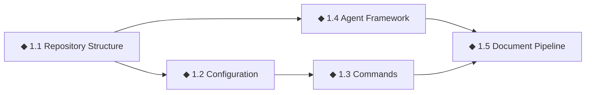
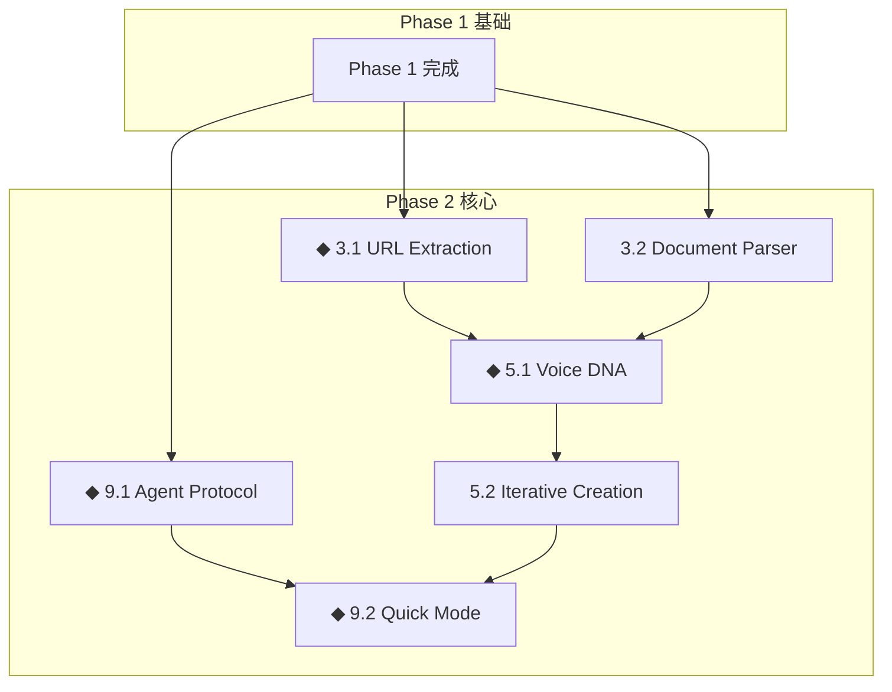
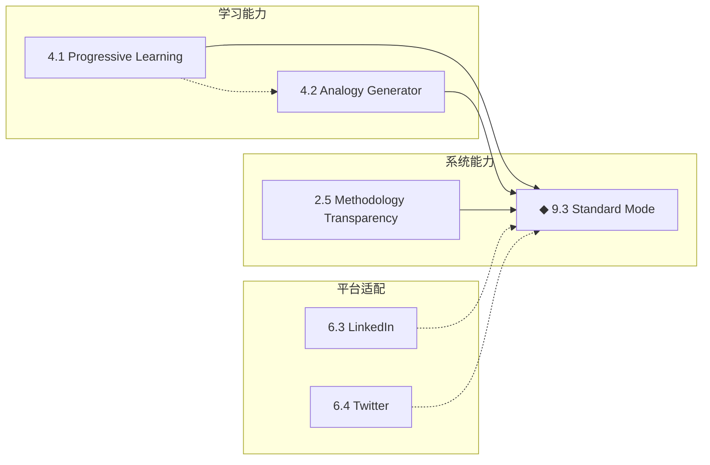
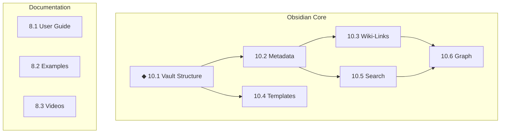

# FLCM Story Dependencies & Sequencing (故事依赖关系与开发顺序)

## 依赖关系图例

```
→  硬依赖 (必须先完成)
⇢  软依赖 (建议先完成)
═  可并行开发
◆  关键路径故事
○  独立故事
```

## Phase 1: Foundation Dependencies (基础层依赖)



### 关键路径
**1.1 → 1.4 → 1.5** (Repository → Agents → Pipeline)
- 这是最关键的技术基础路径
- 阻塞风险：任何延迟都会影响Phase 2

### 开发顺序
1. **必须先做**: 1.1 Repository Structure (2-3h)
2. **并行开发组1**: 
   - 1.2 Configuration (4-5h)
   - 1.4 Agent Framework (5-6h)
3. **并行开发组2**:
   - 1.3 Commands (3-4h) [依赖1.2]
   - 1.5 Document Pipeline (6-7h) [依赖1.4]

---

## Phase 2: Core MVP Dependencies (核心MVP依赖)



### 关键路径
**9.1 → 9.2** (Agent Protocol → Quick Mode)
- Quick Mode是MVP的核心交付
- 依赖所有其他Phase 2故事

### 并行开发策略
```
并行组A (数据输入团队):
═ 3.1 URL Extraction (4-5h)
═ 3.2 Document Parser (3-4h)

并行组B (内容处理团队):
═ 5.1 Voice DNA (5-6h) [等待组A]
═ 5.2 Iterative Creation (4-5h) [依赖5.1]

并行组C (系统集成团队):
═ 9.1 Agent Protocol (5-6h)
═ 9.2 Quick Mode (4-5h) [整合所有]
```

---

## Phase 3: Enhanced Intelligence Dependencies (智能增强依赖)



### 开发灵活性
- **独立开发**: 6.3和6.4可以独立开发
- **可选依赖**: 平台优化不阻塞Standard Mode
- **核心依赖**: 4.1和2.5是Standard Mode的必要条件

---

## Phase 4: Knowledge Persistence Dependencies (知识持久化依赖)



### 两条独立轨道
**轨道1: Obsidian集成** (可以先开发)
- 10.1 必须先完成 (基础)
- 10.2, 10.4 可并行
- 10.3, 10.5 依赖10.2
- 10.6 最后完成 (依赖10.3, 10.5)

**轨道2: 文档系统** (可独立并行)
- 8.1, 8.2, 8.3 完全独立
- 可以分配给不同团队

---

## 跨Phase依赖关系

### 🔴 硬依赖链 (必须按顺序)
```
1.1 Repository
 └→ 1.4 Agent Framework
     └→ 1.5 Document Pipeline
         └→ 9.1 Agent Protocol
             └→ 9.2 Quick Mode (MVP!)
                 └→ 9.3 Standard Mode
```

### 🟡 软依赖建议
```
3.1 URL Extraction
 ⇢ 5.1 Voice DNA (更好的内容理解)
     ⇢ 5.2 Iterative Creation
         ⇢ 6.3/6.4 Platform Optimization
```

### 🟢 独立开发机会
以下故事组可以完全独立开发：
- **文档组**: 8.1, 8.2, 8.3
- **平台优化组**: 6.3, 6.4
- **方法论组**: 2.5
- **学习组**: 4.1, 4.2 (相对独立)

---

## 风险分析与缓解

### 🚨 高风险依赖点

1. **1.4 Agent Framework** 
   - 风险：所有后续功能依赖此基础
   - 缓解：优先分配资深开发者，预留缓冲时间

2. **9.1 Agent Protocol**
   - 风险：Quick Mode的关键依赖
   - 缓解：早期原型验证，迭代开发

3. **10.1 Vault Structure**
   - 风险：所有Obsidian功能的基础
   - 缓解：先验证与Obsidian API兼容性

### ⚠️ 中等风险点

- **5.1 Voice DNA**: 用户体验核心，需要充分测试
- **9.3 Standard Mode**: 复杂度高，需要整合多个组件
- **10.6 Knowledge Graph**: 性能敏感，需要优化

---

## 优化的开发计划

### Sprint 1-2 (Week 1-3): Foundation
```
开发者A: 1.1 → 1.2 → 1.3
开发者B: 1.1 → 1.4 → 1.5
```

### Sprint 3-4 (Week 4-6): MVP Core
```
团队1: 3.1 ═ 3.2 → 测试集成
团队2: 9.1 → 与团队3协调
团队3: 5.1 → 5.2 → 与团队2集成 → 9.2
```

### Sprint 5-6 (Week 7-9): Enhancement
```
团队1: 4.1 ═ 4.2
团队2: 6.3 ═ 6.4
团队3: 2.5 → 9.3 (整合团队1的成果)
```

### Sprint 7-8 (Week 10-12): Persistence
```
团队1: 10.1 → 10.2 → 10.3 → 10.6
团队2: 10.1 → 10.4 ═ 10.5 → 10.6
团队3: 8.1 ═ 8.2 ═ 8.3
```

---

## 并行开发矩阵

| Phase | 最大并行团队数 | 并行故事组 | 节省时间 |
|-------|---------------|-----------|---------|
| Phase 1 | 2 | (1.2, 1.4), (1.3, 1.5) | 30% |
| Phase 2 | 3 | (3.1, 3.2), (5.1→5.2), (9.1) | 40% |
| Phase 3 | 3 | (4.1, 4.2), (6.3, 6.4), (2.5) | 50% |
| Phase 4 | 3 | Obsidian组, 文档组 | 60% |

---

## 关键成功因素

### ✅ 开发顺序优化要点

1. **严格遵守硬依赖**: 特别是关键路径上的故事
2. **充分利用并行机会**: 独立故事组分配给不同团队
3. **预留集成时间**: 每个Phase结束预留10-15%时间用于集成
4. **持续验证**: 每完成一个故事立即验证接口契约

### 📊 进度监控指标

- **关键路径进度**: 1.1→1.4→1.5→9.1→9.2
- **并行效率**: 实际并行度 vs 计划并行度
- **依赖阻塞次数**: 因依赖未完成造成的等待
- **集成成功率**: 首次集成成功的故事百分比

### 🎯 里程碑检查点

1. **Foundation完成**: 所有基础组件可用
2. **MVP可演示**: Quick Mode端到端流程通过
3. **Intelligence就绪**: Standard Mode全功能
4. **Production Ready**: 含Obsidian集成的完整系统

---

## 总结：开发策略建议

### 最优路径
1. **Phase 1-2 串行为主**: 建立坚实基础
2. **Phase 3-4 并行最大化**: 加速交付
3. **文档独立轨道**: 不影响主线开发
4. **持续集成**: 每日集成，及早发现问题

### 资源配置
- **核心团队** (3人): 负责关键路径
- **功能团队** (2-3人): 负责独立功能
- **文档团队** (1-2人): 独立制作文档

### 时间预期
- **串行开发**: 16周
- **优化并行**: 12-13周 (节省25%)
- **理想情况**: 10-11周 (充足资源+高效协作)

---

*此依赖关系图基于26个用户故事的技术分析创建，为开发团队提供清晰的实施路径指导。*