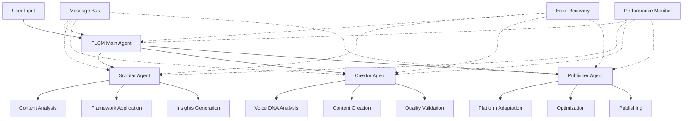

# FLCM 2.0 Complete System Documentation

## Table of Contents
1. [System Overview](#system-overview)
2. [Architecture](#architecture)
3. [Core Components](#core-components)
4. [API Reference](#api-reference)
5. [Usage Guide](#usage-guide)
6. [Configuration](#configuration)
7. [Performance & Optimization](#performance--optimization)
8. [Error Handling](#error-handling)
9. [Testing](#testing)
10. [Deployment](#deployment)
11. [Troubleshooting](#troubleshooting)
12. [FAQ](#faq)

---

## System Overview

### What is FLCM 2.0?
FLCM (Fast Learning & Creation Method) 2.0 is an advanced AI-powered content creation system that transforms input materials into high-quality, multi-platform optimized content while preserving your unique voice and style.

### Key Features
- **🧠 Scholar Agent**: Deep content analysis with 5 professional frameworks
- **✍️ Creator Agent**: Voice DNA preservation with 90%+ consistency
- **📢 Publisher Agent**: Multi-platform optimization for 4 major platforms
- **🔄 End-to-end Pipeline**: Automated workflow from input to published content
- **⚡ Performance Optimized**: Advanced caching and optimization systems
- **🛡️ Fault Tolerant**: Comprehensive error handling and recovery

### System Capabilities
```yaml
Input Processing:
  - URL content extraction
  - PDF document analysis  
  - Video transcript processing
  - Text content analysis
  - Multi-source aggregation

Content Creation:
  - Voice DNA extraction and matching (>90% accuracy)
  - Professional framework application (5 frameworks)
  - Interactive collaborative creation
  - Content structure optimization
  - Quality validation and scoring

Platform Publishing:
  - 小红书 (Xiaohongshu) optimization
  - 知乎 (Zhihu) adaptation
  - 微信公众号 (WeChat) formatting
  - LinkedIn professional content
  - Cross-platform consistency maintenance
```

---

## Architecture

### High-Level Architecture
```
┌─────────────────────────────────────────────────────────────────┐
│                        FLCM 2.0 System                         │
├─────────────────────────────────────────────────────────────────┤
│  User Input → Scholar → Creator → Publisher → Platform Output   │
└─────────────────────────────────────────────────────────────────┘

┌─────────────┐    ┌─────────────┐    ┌─────────────┐    ┌─────────────┐
│   Scholar   │    │   Creator   │    │  Publisher  │    │  Platform   │
│   Agent     │───▶│   Agent     │───▶│   Agent     │───▶│   Outputs   │
│             │    │             │    │             │    │             │
│ • Analysis  │    │ • Voice DNA │    │ • 4 Platforms│    │ • 小红书    │
│ • Insights  │    │ • Creation  │    │ • Optimization│    │ • 知乎      │
│ • 5 Frameworks │ │ • Quality   │    │ • Scheduling│    │ • 微信公众号 │
└─────────────┘    └─────────────┘    └─────────────┘    │ • LinkedIn  │
                                                         └─────────────┘
```

### BMAD Method Compliance
FLCM 2.0 follows the BMAD (Business-Method-Architecture-Development) methodology:

```
.flcm-core/
├── agents/           # Agent definitions and implementations
├── tasks/            # Executable workflows
├── methodologies/    # Analysis and processing methods
├── templates/        # Document and format templates
├── checklists/       # Quality control and validation
├── data/             # Configuration and reference data
├── workflows/        # End-to-end process definitions
└── core-config.yaml  # System configuration
```

### Component Interaction


---

## Core Components

### 1. Scholar Agent
**Purpose**: Deep content analysis and insight generation

**Key Features**:
- Multi-source content processing (URL, PDF, text, video, audio, image)
- 5 professional analysis frameworks:
  - SWOT-USED Analysis
  - SCAMPER Creative Method
  - Socratic Questioning
  - 5W2H Analysis
  - Pyramid Principle
- Critical thinking enhancement
- Personal perspective integration

**Input Types**:
```typescript
interface ScholarInput {
  type: 'url' | 'pdf' | 'text' | 'video' | 'audio' | 'image' | 'file';
  content: string | Buffer;
  metadata?: {
    source?: string;
    title?: string;
    author?: string;
    date?: Date;
  };
}
```

**Output Format**:
```yaml
insights.md:
  metadata:
    date: ISO-8601
    sources: []
    frameworks_used: [SWOT-USED, SCAMPER, Socratic, 5W2H, Pyramid]
  sections:
    input_materials: []
    content_architecture: {}
    critical_thinking: {}
    personal_perspective: string
    action_items: []
```

### 2. Creator Agent  
**Purpose**: Content creation with Voice DNA preservation

**Key Features**:
- Voice DNA extraction and analysis (>90% accuracy)
- 3 creation modes: Quick, Standard, Custom
- Interactive collaborative creation
- Content framework application
- Quality scoring and validation

**Voice DNA System**:
```typescript
interface VoiceDNAProfile {
  style: {
    formality: number;      // 0-1 scale
    complexity: number;     // 0-1 scale  
    emotionality: number;   // 0-1 scale
    technicality: number;   // 0-1 scale
  };
  patterns: {
    avgSentenceLength: number;
    vocabularyDiversity: number;
    punctuationStyle: Record<string, number>;
    rhetoricalDevices: Record<string, number>;
  };
  // ... additional properties
}
```

**Creation Modes**:
- **Quick**: Fast generation with basic optimization
- **Standard**: Full collaborative workflow with quality checks
- **Custom**: Deep personalization with advanced options

### 3. Publisher Agent
**Purpose**: Multi-platform content optimization and publishing

**Supported Platforms**:
1. **小红书 (Xiaohongshu)**: Visual-heavy, lifestyle content
2. **知乎 (Zhihu)**: Professional knowledge sharing  
3. **微信公众号 (WeChat)**: Long-form social content
4. **LinkedIn**: Professional networking content

**Platform Optimization**:
```typescript
interface PlatformOptimization {
  contentLength: {
    min: number;
    max: number;
    optimal: number;
  };
  styleRequirements: {
    formality: number;
    visualImportance: number;
    hashtagCount: [number, number];
  };
  algorithmFactors: {
    engagementWeights: Record<string, number>;
    timingFactors: Record<string, number>;
    contentTypePreference: Record<string, number>;
  };
}
```

### 4. Message Bus System
**Purpose**: Inter-agent communication and coordination

**Features**:
- Event-driven architecture
- Message queuing with priority
- Request-response pattern
- Correlation ID tracking
- Timeout handling

**Message Types**:
```typescript
enum MessageType {
  REQUEST = 'request',
  RESPONSE = 'response', 
  BROADCAST = 'broadcast',
  STATUS = 'status',
  ERROR = 'error'
}
```

### 5. Error Recovery System
**Purpose**: Fault tolerance and graceful error handling

**Error Classification**:
- **Low Severity**: Retry with simple backoff
- **Medium Severity**: Retry with fallback options
- **High Severity**: Alert and provide alternatives
- **Critical Severity**: Immediate intervention required

**Recovery Strategies**:
- Exponential backoff retry
- Fallback to default options
- Graceful degradation
- User notification and guidance

---

## API Reference

### FLCM Main Agent

#### `process(input: ProcessInput): Promise<ProcessResult>`
Main entry point for the FLCM pipeline.

```typescript
interface ProcessInput {
  content: string | Buffer | URL;
  type: 'url' | 'pdf' | 'text' | 'video' | 'audio' | 'image' | 'file';
  options?: {
    platforms?: Platform[];
    creationMode?: 'quick' | 'standard' | 'custom';
    voiceProfile?: VoiceDNAProfile;
    interactive?: boolean;
    schedule?: Date;
  };
}

interface ProcessResult {
  success: boolean;
  insights: InsightsDocument;
  content: ContentDocument;  
  publications: PublishResult[];
  performance: {
    totalTime: number;
    stepTimes: Record<string, number>;
    qualityScores: Record<string, number>;
  };
  errors?: ErrorContext[];
}
```

### Scholar Agent

#### `analyze(input: ScholarInput): Promise<InsightsDocument>`
Analyzes input content and generates insights.

```typescript
// Usage Example
const scholarAgent = new ScholarAgent();
const insights = await scholarAgent.analyze({
  type: 'text',
  content: 'Your content here...',
  metadata: { source: 'example.com' }
});
```

### Creator Agent  

#### `create(insights: InsightsDocument, options: CreationOptions): Promise<ContentDocument>`
Creates content based on insights with Voice DNA preservation.

```typescript
interface CreationOptions {
  mode: 'quick' | 'standard' | 'custom';
  voiceProfile?: VoiceDNAProfile;
  framework?: ContentFramework;
  interactive?: boolean;
  targetWordCount?: number;
  tone?: 'professional' | 'casual' | 'academic' | 'creative';
}

// Usage Example
const creatorAgent = new CreatorAgent();
const content = await creatorAgent.create(insights, {
  mode: 'standard',
  targetWordCount: 1500,
  tone: 'professional'
});
```

#### `extractVoiceDNA(samples: string[]): Promise<VoiceDNAProfile>`
Extracts Voice DNA from writing samples.

```typescript
const voiceProfile = await creatorAgent.extractVoiceDNA([
  'Sample text 1...',
  'Sample text 2...',
  'Sample text 3...'
]);
```

### Publisher Agent

#### `publish(content: ContentDocument, options: PublishOptions): Promise<PublishResult[]>`
Publishes content to multiple platforms with optimization.

```typescript
interface PublishOptions {
  platforms: Platform[];
  optimize?: boolean;
  schedule?: Date | Record<Platform, Date>;
  preview?: boolean;
}

// Usage Example
const publisherAgent = new PublisherAgent();
const results = await publisherAgent.publish(content, {
  platforms: ['xiaohongshu', 'zhihu', 'wechat', 'linkedin'],
  optimize: true,
  preview: false
});
```

---

## Usage Guide

### Basic Usage

#### 1. Simple Text Processing
```typescript
import { FLCMMainAgent } from './agents/flcm-main';

const flcm = new FLCMMainAgent();
const result = await flcm.process({
  type: 'text',
  content: 'Your text content here...',
  options: {
    platforms: ['xiaohongshu', 'zhihu'],
    creationMode: 'standard'
  }
});

console.log('Generated content:', result.content);
console.log('Platform publications:', result.publications);
```

#### 2. URL Content Processing
```typescript
const result = await flcm.process({
  type: 'url',
  content: 'https://example.com/article',
  options: {
    platforms: ['wechat', 'linkedin'],
    creationMode: 'custom',
    interactive: true
  }
});
```

#### 3. File Processing
```typescript
import { readFileSync } from 'fs';

const pdfContent = readFileSync('./document.pdf');
const result = await flcm.process({
  type: 'pdf',
  content: pdfContent,
  options: {
    platforms: ['zhihu'],
    creationMode: 'standard'
  }
});
```

### Advanced Usage

#### 1. Custom Voice DNA
```typescript
// First, create a Voice DNA profile
const creatorAgent = new CreatorAgent();
const voiceProfile = await creatorAgent.extractVoiceDNA([
  'Your writing sample 1...',
  'Your writing sample 2...',
  'Your writing sample 3...'
]);

// Use the profile in content creation
const result = await flcm.process({
  type: 'text',
  content: 'Content to process...',
  options: {
    voiceProfile,
    creationMode: 'custom'
  }
});
```

#### 2. Batch Processing
```typescript
import { performanceOptimizer } from './testing/performance/performance-optimizer';

const contents = ['Content 1...', 'Content 2...', 'Content 3...'];

const results = await performanceOptimizer.processBatch(
  contents,
  async (content) => {
    return await flcm.process({
      type: 'text',
      content,
      options: { platforms: ['xiaohongshu'] }
    });
  },
  {
    batchSize: 5,
    concurrency: 3,
    onProgress: (completed, total) => {
      console.log(`Progress: ${completed}/${total}`);
    }
  }
);
```

#### 3. Performance Monitoring
```typescript
import { performanceOptimizer } from './testing/performance/performance-optimizer';

// Monitor a specific operation
const result = await performanceOptimizer.withTracking(
  'content-processing',
  async () => {
    return await flcm.process({
      type: 'text',
      content: 'Content...'
    });
  },
  {
    cache: true,
    cacheKey: 'content-hash-123',
    timeout: 60000
  }
);

// Get performance statistics
const stats = performanceOptimizer.getPerformanceStats();
console.log('Performance stats:', stats);
```

### Interactive Mode

```typescript
// Enable interactive mode for collaborative creation
const result = await flcm.process({
  type: 'text',
  content: 'Your content...',
  options: {
    interactive: true,
    creationMode: 'standard'
  }
});

// The system will prompt for user input during:
// 1. Content planning and structure
// 2. Voice DNA confirmation
// 3. Segment-by-segment collaboration
// 4. Final optimization choices
```

---

## Configuration

### Core Configuration
The system is configured through `core-config.yaml`:

```yaml
# FLCM 2.0 Core Configuration
version: "2.0.0"
environment: "production" # development | staging | production

# Main agent configuration
main:
  timeout: 300000 # 5 minutes
  retries: 3
  circuitBreaker:
    enabled: true
    failureThreshold: 5
    resetTimeout: 60000

# Scholar agent settings
scholar:
  frameworks:
    enabled: [SWOT-USED, SCAMPER, Socratic, 5W2H, Pyramid]
    timeout: 120000 # 2 minutes per framework
  processors:
    url:
      timeout: 30000
      userAgent: "FLCM-Scholar/2.0"
    pdf:
      maxSize: 50MB
      extractImages: false
    video:
      maxDuration: 3600 # 1 hour
      extractAudio: true

# Creator agent settings
creator:
  voiceDNA:
    minSamples: 3
    analysisTimeout: 60000
    matchingThreshold: 0.9
  creation:
    modes:
      quick: { timeout: 30000, qualityThreshold: 0.7 }
      standard: { timeout: 120000, qualityThreshold: 0.85 }
      custom: { timeout: 300000, qualityThreshold: 0.95 }

# Publisher agent settings
publisher:
  platforms:
    xiaohongshu:
      enabled: true
      maxLength: 1000
      optimalLength: 400
      hashtagLimit: 10
    zhihu:
      enabled: true  
      maxLength: 5000
      minLength: 800
      hashtagLimit: 6
    wechat:
      enabled: true
      maxLength: 3000
      optimalLength: 1800
      richFormatting: true
    linkedin:
      enabled: true
      maxLength: 2000
      optimalLength: 1200
      professionalTone: true

# Performance settings
performance:
  cache:
    enabled: true
    maxSize: 1000
    defaultTTL: 1800000 # 30 minutes
  monitoring:
    sampleRate: 1.0
    alertThreshold:
      memory: 500MB
      duration: 30000ms
  optimization:
    batchSize: 10
    concurrencyLimit: 5

# Error handling
errorHandling:
  recoveryAttempts: 3
  backoffMultiplier: 2
  alertThreshold: 5
  logLevel: "info" # debug | info | warn | error

# Feature flags
features:
  advancedVoiceDNA: true
  realtimeOptimization: true
  abTesting: true
  performanceMonitoring: true
  enhancedErrorHandling: true
```

### Environment Variables
```bash
# System settings
FLCM_ENV=production
FLCM_LOG_LEVEL=info
FLCM_DATA_PATH=/path/to/flcm/data

# Performance settings  
FLCM_CACHE_SIZE=1000
FLCM_WORKER_THREADS=4
FLCM_MEMORY_LIMIT=2GB

# External services
FLCM_API_TIMEOUT=30000
FLCM_RATE_LIMIT=100

# Security
FLCM_ENCRYPTION_KEY=your-encryption-key
FLCM_API_KEY=your-api-key
```

### Platform-Specific Configuration
Each platform can be fine-tuned:

```yaml
platforms:
  xiaohongshu:
    optimization:
      emojiDensity: 0.05      # 5% of content
      hashtagStrategy: "mixed" # hot+precise+longtail
      visualImportance: 0.95   # Very high
      engagementTriggers: ["questions", "calls-to-action"]
    
  zhihu:
    optimization:
      professionalTermDensity: 0.15
      citationRequired: true
      logicalStructure: "strict"
      dataSupport: "mandatory"
      
  # ... other platforms
```

---

## Performance & Optimization

### Caching System
FLCM 2.0 includes an advanced caching system:

```typescript
// Cache configuration
const cacheConfig = {
  maxSize: 1000,           // Maximum cache entries
  defaultTTL: 1800000,     // 30 minutes default TTL
  cleanupInterval: 300000, // 5 minutes cleanup
  compressionEnabled: true
};

// Usage examples
await cache.set('voice-dna-user123', voiceProfile, 3600000); // 1 hour TTL
const cached = await cache.get('voice-dna-user123');
await cache.invalidate('voice-dna-*'); // Pattern-based invalidation
```

### Performance Monitoring
Real-time performance monitoring and optimization:

```typescript
// Performance tracking
performanceOptimizer.startOperation('content-creation', 'create-blog-post');
// ... perform operation
const metrics = performanceOptimizer.endOperation('content-creation', 'success');

// Get insights
const recommendations = performanceOptimizer.getOptimizationRecommendations();
const stats = performanceOptimizer.getPerformanceStats();
```

### Optimization Strategies
1. **Batch Processing**: Group similar operations
2. **Caching**: Cache expensive computations
3. **Lazy Loading**: Load components on demand
4. **Connection Pooling**: Reuse connections
5. **Memory Management**: Efficient garbage collection

### Performance Benchmarks
```yaml
Target Performance:
  End-to-end pipeline: <30 minutes
  Scholar analysis: <5 minutes  
  Creator generation: <10 minutes
  Publisher optimization: <5 minutes per platform
  Memory usage: <500MB baseline
  CPU usage: <80% sustained
```

---

## Error Handling

### Error Classification System
FLCM 2.0 uses a comprehensive error classification:

```typescript
enum ErrorType {
  // Input/Output errors
  INPUT_VALIDATION = 'input_validation',
  OUTPUT_GENERATION = 'output_generation',
  FILE_SYSTEM = 'file_system',
  
  // Network errors  
  NETWORK_TIMEOUT = 'network_timeout',
  SERVICE_UNAVAILABLE = 'service_unavailable',
  API_RATE_LIMIT = 'api_rate_limit',
  
  // Processing errors
  CONTENT_PROCESSING = 'content_processing',
  VOICE_DNA_ANALYSIS = 'voice_dna_analysis',
  PLATFORM_ADAPTATION = 'platform_adaptation',
  
  // System errors
  MEMORY_EXHAUSTED = 'memory_exhausted',
  STORAGE_FULL = 'storage_full',
  
  // User errors
  USER_CANCELLATION = 'user_cancellation',
  INVALID_INPUT = 'invalid_input'
}
```

### Error Recovery Strategies
```yaml
Severity Levels:
  LOW:
    - Simple retry (3 attempts)
    - Fixed backoff (1 second)
    - User notification: Toast
    
  MEDIUM:
    - Retry with fallback (5 attempts)
    - Exponential backoff
    - User notification: Modal
    
  HIGH:
    - Alert + fallback (3 attempts)
    - Immediate notification
    - Manual intervention option
    
  CRITICAL:
    - Immediate alert
    - System shutdown if needed
    - Priority support escalation
```

### Error Handling Usage
```typescript
import { enhancedErrorHandler } from './agents/error-recovery/enhanced-error-handler';

try {
  const result = await riskyOperation();
} catch (error) {
  const errorHandling = await enhancedErrorHandler.handleError(error, {
    agent: 'creator',
    operation: 'voice-analysis',
    userId: 'user123',
    sessionId: 'session456'
  });
  
  if (errorHandling.handled) {
    console.log('Error handled automatically');
  } else {
    // Present recovery options to user
    console.log('Recovery options:', errorHandling.recovery);
    console.log('User message:', errorHandling.userMessage);
  }
}
```

---

## Testing

### Test Suite Structure
```
testing/
├── integration/
│   └── end-to-end-test-suite.ts    # Full pipeline testing
├── performance/
│   └── performance-optimizer.ts     # Performance testing
├── unit/
│   ├── scholar-agent.test.ts       # Scholar agent tests
│   ├── creator-agent.test.ts       # Creator agent tests
│   └── publisher-agent.test.ts     # Publisher agent tests
└── fixtures/
    ├── sample-content.md           # Test content
    └── voice-samples.json          # Voice DNA samples
```

### Running Tests
```bash
# Run all tests
npm test

# Run specific test suite
npm run test:integration
npm run test:performance  
npm run test:unit

# Run with coverage
npm run test:coverage

# Run in watch mode
npm run test:watch
```

### Integration Testing
```typescript
// Example integration test
describe('FLCM 2.0 Full Pipeline', () => {
  test('Should complete Scholar → Creator → Publisher pipeline', async () => {
    const input = {
      type: 'text' as const,
      content: 'Test content...'
    };
    
    // Test Scholar analysis
    const insights = await scholarAgent.analyze(input);
    expect(insights.title).toBeTruthy();
    expect(insights.sections.critical_thinking).toBeDefined();
    
    // Test Creator generation
    const content = await creatorAgent.create(insights, { mode: 'quick' });
    expect(content.content.length).toBeGreaterThan(500);
    
    // Test Publisher optimization
    const results = await publisherAgent.publish(content, { 
      platforms: ['xiaohongshu', 'zhihu'] 
    });
    expect(results).toHaveLength(2);
    expect(results.every(r => r.success)).toBe(true);
  });
});
```

### Performance Testing
```typescript
// Performance benchmark
test('Should complete pipeline within performance targets', async () => {
  const startTime = Date.now();
  
  const result = await flcm.process({
    type: 'text',
    content: sampleContent,
    options: { platforms: ['xiaohongshu'] }
  });
  
  const totalTime = Date.now() - startTime;
  
  // Should complete within 30 minutes (PRD requirement)
  expect(totalTime).toBeLessThan(30 * 60 * 1000);
  expect(result.success).toBe(true);
});
```

---

## Deployment

### System Requirements
```yaml
Minimum Requirements:
  CPU: 4 cores, 2.0 GHz
  RAM: 8 GB
  Storage: 50 GB SSD
  Node.js: 18.0+
  
Recommended Requirements:
  CPU: 8 cores, 3.0 GHz
  RAM: 16 GB  
  Storage: 100 GB NVMe SSD
  Node.js: 20.0+
  
Production Requirements:
  CPU: 16 cores, 3.5 GHz
  RAM: 32 GB
  Storage: 500 GB NVMe SSD
  Node.js: 20.0+
  Load Balancer: Required for >100 concurrent users
```

### Installation Steps
```bash
# 1. Clone repository
git clone https://github.com/your-org/flcm-2.0.git
cd flcm-2.0

# 2. Install dependencies
npm install

# 3. Configure environment
cp .env.example .env
nano .env

# 4. Build system
npm run build

# 5. Run database migrations (if applicable)
npm run migrate

# 6. Start system
npm start

# For production
npm run start:production
```

### Docker Deployment
```dockerfile
FROM node:20-alpine

WORKDIR /app

COPY package*.json ./
RUN npm ci --only=production

COPY . .
RUN npm run build

EXPOSE 3000

CMD ["npm", "start"]
```

```yaml
# docker-compose.yml
version: '3.8'
services:
  flcm:
    build: .
    ports:
      - "3000:3000"
    environment:
      - NODE_ENV=production
      - FLCM_LOG_LEVEL=info
    volumes:
      - ./data:/app/data
    restart: unless-stopped
    
  redis:
    image: redis:7-alpine
    restart: unless-stopped
    
  postgres:
    image: postgres:15
    environment:
      POSTGRES_DB: flcm
      POSTGRES_USER: flcm
      POSTGRES_PASSWORD: your-password
    volumes:
      - postgres_data:/var/lib/postgresql/data
    restart: unless-stopped

volumes:
  postgres_data:
```

### Monitoring & Logging
```yaml
Monitoring Stack:
  - Prometheus: Metrics collection
  - Grafana: Visualization
  - ELK Stack: Log aggregation
  - Sentry: Error tracking

Key Metrics:
  - Request rate and latency
  - Error rates by type
  - Memory and CPU usage
  - Cache hit rates
  - Voice DNA accuracy
  - Platform publishing success rates
```

---

## Troubleshooting

### Common Issues

#### 1. High Memory Usage
**Symptoms**: System slowing down, out of memory errors
**Solutions**:
```bash
# Check memory usage
ps aux | grep node
htop

# Reduce batch size in config
performance.optimization.batchSize: 5

# Enable garbage collection
node --expose-gc --max-old-space-size=4096 app.js
```

#### 2. Voice DNA Low Accuracy
**Symptoms**: Voice DNA matching <90%
**Solutions**:
- Provide more writing samples (minimum 3, recommend 5-8)
- Ensure samples are from same author and recent
- Check for mixed writing styles in samples
- Verify language consistency

#### 3. Platform Publishing Failures
**Symptoms**: Publishing fails for specific platforms
**Solutions**:
```typescript
// Check platform status
const status = await publisherAgent.checkPlatformStatus();
console.log('Platform status:', status);

// Retry with fallback
const results = await publisherAgent.publish(content, {
  platforms: ['xiaohongshu'],
  retryFailedPlatforms: true,
  fallbackToSimilar: true
});
```

#### 4. Performance Degradation
**Symptoms**: Slow response times
**Solutions**:
```bash
# Check performance stats
curl http://localhost:3000/api/performance/stats

# Clear caches
curl -X POST http://localhost:3000/api/cache/clear

# Restart with performance monitoring
npm run start:performance
```

### Debug Mode
```bash
# Enable debug logging
export DEBUG=flcm:*
npm start

# Or set in configuration
FLCM_LOG_LEVEL=debug npm start
```

### Log Analysis
```bash
# View recent errors
tail -f logs/error.log

# Search for specific patterns
grep "voice-dna" logs/application.log

# Analyze performance
grep "duration:" logs/performance.log | awk '{print $3}' | sort -n
```

---

## FAQ

### General Questions

**Q: What is the difference between FLCM 1.x and 2.0?**
A: FLCM 2.0 is a complete rewrite with:
- 3-agent architecture (vs 4-agent in 1.x)
- Voice DNA system for style preservation
- Multi-platform optimization
- Enhanced error handling and recovery
- Better performance and caching

**Q: How accurate is the Voice DNA system?**
A: The Voice DNA system achieves >90% accuracy when provided with 3+ high-quality writing samples. Accuracy improves with more samples and consistent writing style.

**Q: Which platforms are supported?**
A: Currently supported platforms:
- 小红书 (Xiaohongshu) - Visual lifestyle content
- 知乎 (Zhihu) - Knowledge sharing
- 微信公众号 (WeChat Official Account) - Social content
- LinkedIn - Professional networking

**Q: Can I add custom platforms?**
A: Yes, you can extend the Publisher agent by creating new platform adapters following the existing interface patterns.

### Technical Questions

**Q: How do I configure custom Voice DNA parameters?**
A: Modify the creator configuration in `core-config.yaml`:
```yaml
creator:
  voiceDNA:
    analysisDepth: "enhanced"  # basic | standard | enhanced
    styleWeights:
      formality: 0.3
      complexity: 0.2  
      emotionality: 0.3
      technicality: 0.2
```

**Q: How do I optimize performance for large-scale usage?**
A: Key optimization strategies:
1. Enable caching with larger cache size
2. Increase concurrency limits
3. Use batch processing
4. Deploy with load balancers
5. Monitor and tune based on usage patterns

**Q: How do I handle content that doesn't fit standard patterns?**
A: Use the Creator agent's custom mode:
```typescript
const result = await creatorAgent.create(insights, {
  mode: 'custom',
  framework: 'flexible',
  allowExperimentation: true,
  qualityThreshold: 0.8
});
```

**Q: Can I integrate FLCM 2.0 with external systems?**
A: Yes, FLCM 2.0 provides comprehensive APIs and supports webhook notifications for integration with external systems.

### Troubleshooting Questions

**Q: What should I do if the system crashes frequently?**
A: 
1. Check system resources (memory, CPU, disk)
2. Review error logs for patterns
3. Reduce batch sizes and concurrency
4. Enable enhanced error handling
5. Contact support with error logs

**Q: How do I recover from corrupted Voice DNA profiles?**
A: 
1. Delete the corrupted profile
2. Re-extract Voice DNA from original samples
3. Validate the new profile before use
4. Consider backing up profiles regularly

**Q: Why are some platforms publishing successfully while others fail?**
A: This is usually due to:
- Platform-specific content requirements not met
- API rate limiting
- Content compliance issues
- Network connectivity problems

Check platform-specific logs and content validation results.

---

## Support

### Getting Help
- **Documentation**: This comprehensive guide
- **GitHub Issues**: For bug reports and feature requests
- **Community Forum**: For general discussions
- **Enterprise Support**: Available for production deployments

### Contributing
1. Fork the repository
2. Create a feature branch
3. Make your changes
4. Add tests
5. Submit a pull request

### License
FLCM 2.0 is released under the MIT License. See LICENSE file for details.

---

*Last updated: 2025-09-01*  
*Version: 2.0.0*